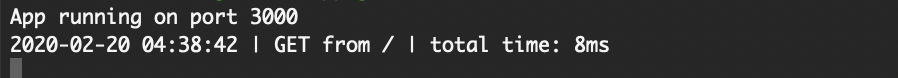

# Timestamp Version 2

一個能將使用者請求的HTTP方法、時間戳記、位址、等候回應時長印出於終端機的middleware

## 環境建置與需求 (Prerequisites)

* [Node.js](https://nodejs.org/)
* [Express ^4.17.1](https://expressjs.com)
* [Moment ^2.24.0](https://www.npmjs.com/package/moment)


## 安裝與執行步驟 (Installing and execution)

1.開啟終端機(Terminal)，clone到本機專案位置:

```
git clone https://github.com/bluesmy/time_stamp_2.git
```

2.切換至專案資料夾

```
cd time_stamp_2
```

3.安裝套件
```
npm install  //自動安裝package.json內套件
```

4.啟動伺服器，並執行專案

```
npm run dev
```

5.當終端機顯示以下字樣，表示伺服器與資料庫已啟動並成功連結
`App is running on port 3000`

```
Ctrl + C *2  //連按兩下 Ctrl + C 關閉伺服器
```

瀏覽器輸入 [http://localhost:3000](http://localhost:3000) 即可開始使用。

## 功能描述 (Features)

- 使用者對網頁發出請求時，終端機會顯示請求時間、請求方法、請求位址、等候回應時長。

## 專案畫面 (Screenshot)



## 專案使用工具 (Built With)

* [Visual Studio Code](https://code.visualstudio.com/) - The integrated development environment used
* [Express](https://expressjs.com) - The web framework used
* [Moment](https://www.npmjs.com/package/moment) - A lightweight JavaScript date library for parsing, validating, manipulating, and formatting dates

## 專案開發人員 (Contributor)

* **Sheri Su** - [bluesmy](https://github.com/bluesmy)
